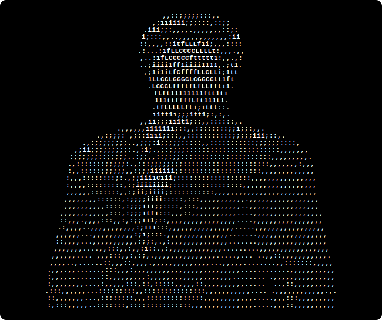
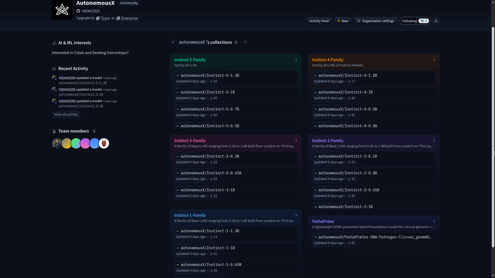
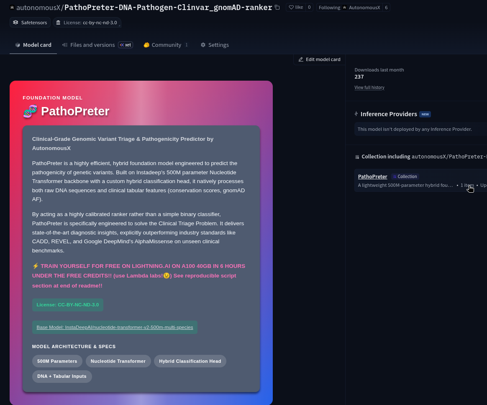

<div align="center">

<!-- ═══════════════════════════════════════════════════════════════════ -->
<!--                        🔥 ANIMATED HEADER                        -->
<!-- ═══════════════════════════════════════════════════════════════════ -->

<h1 align="center"><p align="center">
  
</p></h1>

<!-- ═══════════════════════════════════════════════════════════════════ -->
<!--                       👤 ASCII PORTRAIT                           -->
<!-- ═══════════════════════════════════════════════════════════════════ -->

<p align="center">
  
</p>

<br/>

<pre>


  ██████╗  ██████╗ ██╗  ██╗██╗████████╗    ██╗   ██╗ █████╗ ██████╗  █████╗ ██╗   ██╗
  ██╔══██╗██╔═══██╗██║  ██║██║╚══██╔══╝    ╚██╗ ██╔╝██╔══██╗██╔══██╗██╔══██╗██║   ██║
  ██████╔╝██║   ██║███████║██║   ██║        ╚████╔╝ ███████║██║  ██║███████║██║   ██║
  ██╔══██╗██║   ██║██╔══██║██║   ██║         ╚██╔╝  ██╔══██║██║  ██║██╔══██║╚██╗ ██╔╝
 ██║  ██║╚██████╔╝██║  ██║██║   ██║          ██║   ██║  ██║██████╔╝██║  ██║ ╚████╔╝
╚═╝  ╚═╝ ╚═════╝ ╚═╝  ╚═╝╚═╝   ╚═╝          ╚═╝   ╚═╝  ╚═╝╚═════╝ ╚═╝  ╚═╝  ╚═══╝

</pre>

<br/>

<!-- ═══════════════════════════════════════════════════════════════════ -->
<!--                        🏷️ BADGES & LINKS                         -->
<!-- ═══════════════════════════════════════════════════════════════════ -->

[](https://rohit-portfolio-yadav1825.vercel.app)
[](https://www.linkedin.com/in/rohit-yadav-25535b256/)
[](https://huggingface.co/autonomousX)
[](mailto:yrohit1825@gmail.com)

<br/>

### **[🖥️ About](#about-me) • [💼 Experience](#experience) • [🚀 Projects](#featured-projects) • [🛠️ Stack](#tech-stack) • [📄 Resume](#resume)**

</div>

---

<!-- ═══════════════════════════════════════════════════════════════════ -->
<!--                        🧠 ABOUT ME                                -->
<!-- ═══════════════════════════════════════════════════════════════════ -->

##  About Me


I'm **Rohit Yadav**, a 4th-year **Information Technology** student at <a href="https://www.nitj.ac.in/"><b>NIT Jalandhar</b></a> , and I don't just use tools, **I build them**.

I specialize in building systems **end-to-end** , from low-level infrastructure *(bootloaders, virtual machines, compilers, operating systems)* to **AI/ML**, genomics, and large-scale data pipelines.

### 🔥 What Sets Me Apart

- 🧠 **Built 25+ LLMs from scratch** , 120M to 1.4B parameters on TPU clusters
- 🔬 Trained on **500 Billion+ tokens** using Google's TPU Research Cloud
- 🏗️ Built a complete **Compiler → Virtual Machine → OS** pipeline from scratch
- 🧬 Created a **500M-param DNA Foundation Model** outperforming AlphaMissense & CADD
- 💡 *No frameworks, just raw memory and metal*

<br clear="right"/>

---

<!-- ═══════════════════════════════════════════════════════════════════ -->
<!--                   🏅 RECOGNITIONS & GRANTS                        -->
<!-- ═══════════════════════════════════════════════════════════════════ -->

## 🏅 Recognitions & Grants

<div align="center">

<table>
  <tr>
    <td align="center" width="290">
      
      <br/><br/>
      <b>☁️ Google TRC Grant</b>
      <br/>
      <sub>Awarded <b>320 TPU access</b><br/>(SPOT + STANDARD VMs)<br/>for large-scale LLM training & research</sub>
    </td>
    <td align="center" width="290">
      
      <br/><br/>
      <b>🔴 AMD MI300X GPU</b>
      <br/>
      <sub>Awarded <b>300 non-preemptive hours</b><br/>on AMD's flagship MI300X accelerator<br/>for high-performance AI workloads</sub>
    </td>
    <td align="center" width="290">
      
      <br/><br/>
      <b>🎓 Amazon ML Summer School</b>
      <br/>
      <sub>Selected among <b>3,000 from 134,000+</b><br/>applicants for Amazon's flagship<br/>ML training program (2026)</sub>
    </td>
  </tr>
</table>

<table>
  <tr>
    <td align="center" width="435">
      
      <br/><br/>
      <b>🔬 KVPY SA , AIR 2590</b>
      <br/>
      <sub>Kishore Vaigyanik Protsahan Yojana<br/><b>All India Rank 2590</b><br/>National Science Aptitude Fellowship</sub>
    </td>
    <td align="center" width="435">
      
      <br/><br/>
      <b>🧮 IOQM / PRMO Awardee</b>
      <br/>
      <sub>Qualified <b>Indian Olympiad Qualifier</b><br/>in Mathematics (PRMO → IOQM)<br/>National Math Olympiad pathway</sub>
    </td>
  </tr>
</table>

</div>

---

<!-- ═══════════════════════════════════════════════════════════════════ -->
<!--                    💼 EXPERIENCE                                  -->
<!-- ═══════════════════════════════════════════════════════════════════ -->

## 💼 Experience

| Role | Organization | Duration |
|:-----|:-------------|:---------|
| 🤖 **AI Research Intern** | Molsys Pvt. Ltd. | Jun 2026 – Present |
| 🔬 **Research Lead** | [AutonomousX](https://huggingface.co/autonomousX) | Apr 2026 – Present |
| 🎓 **ML Summer School** | Amazon *(Selected: 3,000 / 134,000+ applicants)* | Jun 2026 – Jul 2026 |
| 🌐 **Open Source Contributor** | [Google DeepMind Gemma](https://github.com/google-deepmind/gemma/pull/624) · [Meta LLaMA](https://github.com/meta-llama/llama-models/pull/476) | Mar 2026 – Present |
| 🖥️ **Full-Stack Web Dev Intern** | Skylark Express Delhi Pvt Ltd *(On-site, Gurugram)* | Jun 2025 – Jul 2025 |

---

<!-- ═══════════════════════════════════════════════════════════════════ -->
<!--                     🚀 FEATURED PROJECTS                         -->
<!-- ═══════════════════════════════════════════════════════════════════ -->

## Featured Projects

<br/>


<h1 align="center">AutonomousX</h1>

###  AutonomousX: TPU-Native LLM Training Organization (Instinct Model Family)


<p align="center">
  
</p>

> **`AI/ML` · `LLMs` · `Transformers` · `Distributed Systems` · `JAX` · `TPU`**

- 🏗️ Built and open-sourced **25+ LLMs (120M–1.4B params)** by engineering **TPU-native distributed pipelines (JAX pmap)** under AutonomousX
- 📊 Trained the **Instinct model family** on **500B+ tokens** (PILE, DOLMA) under extreme overtraining regimes to study **scaling laws, convergence, and degeneration dynamics**
- 📹 Open-sourced complete pipelines including HuggingFace weights, training logs, and a [10-minute TPU setup guide](https://www.youtube.com/watch?v=FqXr8GTscNk)
- 🧪 Provided a [ready-to-run inference notebook](https://colab.research.google.com/drive/1cw2VOYaLhASGrx7M4VGVSYYSVYMlt6sD?usp=sharing) for quick evaluation

<p align="center">
  <a href="https://huggingface.co/autonomousX"></a>
</p>

<br/>

---

<br/>

###  RAGE-BORN: AI Terminal Agent with Autonomous Tool Execution

<div align="center">
<pre>
██████╗  █████╗  ██████╗ ███████╗    ██████╗  ██████╗ ██████╗ ███╗   ██╗
██╔══██╗██╔══██╗██╔════╝ ██╔════╝    ██╔══██╗██╔═══██╗██╔══██╗████╗  ██║
██████╔╝███████║██║  ███╗█████╗      ██████╔╝██║   ██║██████╔╝██╔██╗ ██║
██╔══██╗██╔══██║██║   ██║██╔══╝      ██╔══██╗██║   ██║██╔══██╗██║╚██╗██║
██║  ██║██║  ██║╚██████╔╝███████╗    ██████╔╝╚██████╔╝██║  ██║██║ ╚████║
╚═╝  ╚═╝╚═╝  ╚═╝ ╚═════╝ ╚══════╝    ╚═════╝  ╚═════╝ ╚═╝  ╚═╝╚═╝  ╚═══╝
</pre>
</div>

<p align="center">
  
</p>

> **`AI Agents` · `LLM Systems` · `Terminal Automation` · `Browser Agents`**

- 🤖 Built an **AI-powered terminal agent** for Linux with **25+ integrated tools** enabling autonomous terminal execution, file editing, web search, browser automation, and Google Workspace operations through natural language
- 🧠 Designed a **planner → tool execution → feedback loop** with persistent memory, multi-terminal sessions, background task management, and safety confirmation for destructive commands
- 🌐 Implemented **Playwright-based browser automation**, persistent profiles, Google Workspace integration, and intelligent web research
- 🔧 Engineered a production-style CLI with modular tool architecture, task history, markdown rendering, and extensible plugin design

<p align="center">
  <a href="https://github.com/YADAV1825/RAGE-BORN"></a>
</p>

<br/>

---

<br/>

<h1 align="center">PathoPreter</h1>

###  PathoPreter: Clinical-Grade SNV Pathogenicity Ranker (DNA Foundation Model)

<p align="center">
  
</p>

> **`AI/ML` · `GenAI for Biology` · `Foundation Models` · `Bioinformatics`**

- 🧬 Developed a **hybrid genomic foundation model (500M params)** fusing a Nucleotide Transformer backbone with clinical tabular features for **SNV pathogenicity prediction**
- 📈 Achieved **0.9186 ROC-AUC** , outperforming industry SOTA (AlphaMissense, CADD) by **+0.32 ROC-AUC**
- 🏥 Designed a **ranking-first clinical triage system** with **75%+ pathogen recall** while testing only 5–10% of variants
- 🔍 Validated via **SHAP ablation studies** (64.9% reliance on raw DNA) and open-sourced the full pipeline

<p align="center">
  <a href="https://huggingface.co/autonomousX/PathoPreter-DNA-Pathogen-Clinvar_gnomAD-ranker"></a>
</p>

<br/>

---

<br/>

<h1 align="center">BroLang Stack</h1>

###  BroLang Compiler + Custom Virtual Machine 


```python
letbro a = 10;
letbro b = 3;
printbro(a + b);

letbro a = 10;
letbro b = 3;
printbro(a / b);   

letbro a = 10;
letbro b = 3;
printbro(a - b);

letbro a = 10;
letbro b = 3;
printbro(a * b);

ifbro (a > b) {
    printbro(999);
} elsebro {
    printbro(111);
}

ifbro (a < b) {
    printbro(222);
} elsebro {
    printbro(888); 
}

ifbro (a == b) {
    printbro(333);
} elsebro {
    printbro(777);  
}

letbro counter = 0;
whilebro (counter < 3) {
    printbro(counter);   
    letbro counter = counter + 1;
}
```

> **`Systems Programming` · `Compilers` · `Runtime Systems` · `C++`**

- 🔧 Designed a **complete compiler from scratch** for a custom language , implementing Lexer, Parser, AST, and Bytecode Generator
- 💻 Built a **custom 16-bit Virtual Machine (VCPU + 65KB RAM)** , inspired by Java + JVM-style execution
- ⚙️ Full runtime system: **instruction decoding, stack-based execution, control flow, and I/O operations**
- 🛠️ **Tech:** Modern C++17, custom ISA design, bytecode architecture, manual memory management

<p align="center">
  <a href="https://github.com/YADAV1825/BroLang-Stack"></a>
</p>

<br/>

---

<!-- ═══════════════════════════════════════════════════════════════════ -->
<!--                     🛠️ TECH STACK                                 -->
<!-- ═══════════════════════════════════════════════════════════════════ -->

<a id="tech-stack"></a>
## 🛠️ Tech Stack

<div align="center">

**Languages**


**AI & Distributed Training**


**Frameworks & Web**


**Cloud & Systems**


</div>

---

<!-- ═══════════════════════════════════════════════════════════════════ -->
<!--                       🏆 ACHIEVEMENTS                            -->
<!-- ═══════════════════════════════════════════════════════════════════ -->

## 🏆 Achievements

<table>
  <tr>
    <td>☁️</td>
    <td><b>Google TRC Grant</b> , 320 TPU access (SPOT + STANDARD VMs)</td>
  </tr>
  <tr>
    <td>🔴</td>
    <td><b>AMD MI300X GPU</b> , 300 non-preemptive hours</td>
  </tr>
  <tr>
    <td>🎓</td>
    <td><b>Amazon ML Summer School 2026</b> , Selected among 3,000 from 134,000+ applicants</td>
  </tr>
  <tr>
    <td>🧮</td>
    <td><b>IOQM (PRMO)</b> , Qualified for Indian Olympiad Qualifier in Mathematics &nbsp; <a href="https://drive.google.com/file/d/1nG8TuR_yEdqlIbPjkqr3zZQIqzImxh9h/view">[Certificate]</a></td>
  </tr>
  <tr>
    <td>🔬</td>
    <td><b>KVPY SA</b> , AIR 2590 &nbsp; <a href="https://drive.google.com/file/d/1K3Wm7S8cNBQTk5Y9ydm80xcvCMz26IUX/view?usp=drive_link">[Certificate]</a></td>
  </tr>
  <tr>
    <td>⚔️</td>
    <td><b>LeetCode</b> , Knight (2013), 600+ problems &nbsp; <a href="https://leetcode.com/u/tomodachi_/">[Profile]</a></td>
  </tr>
  <tr>
    <td>⭐</td>
    <td><b>CodeChef</b> , 4-Star (1818) &nbsp; <a href="https://www.codechef.com/users/tomodachi">[Profile]</a></td>
  </tr>
  <tr>
    <td>🏅</td>
    <td><b>Codeforces</b> , Specialist (1417) &nbsp; <a href="https://codeforces.com/profile/tomodachi_">[Profile]</a></td>
  </tr>
  <tr>
    <td>🥇</td>
    <td><b>CodeChef START166B</b> , Global Rank 9 &nbsp; <a href="https://www.codechef.com/rankings/START166B?itemsPerPage=100&order=asc&page=1&sortBy=rank">[Contest]</a></td>
  </tr>
</table>

---

<!-- ═══════════════════════════════════════════════════════════════════ -->
<!--                          📄 RESUME                                -->
<!-- ═══════════════════════════════════════════════════════════════════ -->

<a id="resume"></a>
## 📄 Resume

<div align="center">

<h3>📄 <a href="https://rohit-portfolio-yadav1825.vercel.app/Resume_rohit_yadav.pdf"><b>View My Resume (PDF)</b></a></h3>

<a href="https://rohit-portfolio-yadav1825.vercel.app/Resume_rohit_yadav.pdf">
  
</a>

</div>

---

<!-- ═══════════════════════════════════════════════════════════════════ -->
<!--                      🌐 PORTFOLIO                                 -->
<!-- ═══════════════════════════════════════════════════════════════════ -->

## 🌐 Portfolio

<div align="center">

<a href="https://rohit-portfolio-yadav1825.vercel.app/">
  
</a>

</div>

<br/>

<p align="center">
  
</p>

---

<!-- ═══════════════════════════════════════════════════════════════════ -->
<!--                     📬 CONTACT ME                                 -->
<!-- ═══════════════════════════════════════════════════════════════════ -->

## 📬 Contact Me

<div align="center">

I'm always open to interesting conversations, collaborations, and opportunities!

<br/>

<table>
  <tr>
    <td align="center" width="200">
      <a href="mailto:yrohit1825@gmail.com">
        
      </a>
      <br/>
      <sub><b>yrohit1825@gmail.com</b></sub>
    </td>
    <td align="center" width="200">
      <a href="https://www.linkedin.com/in/rohit-yadav-25535b256/">
        
      </a>
      <br/>
      <sub><b>Rohit Yadav</b></sub>
    </td>
    <td align="center" width="200">
      <a href="https://github.com/YADAV1825">
        
      </a>
      <br/>
      <sub><b>YADAV1825</b></sub>
    </td>
    <td align="center" width="200">
      <a href="https://huggingface.co/autonomousX">
        
      </a>
      <br/>
      <sub><b>AutonomousX</b></sub>
    </td>
  </tr>
</table>

<table>
  <tr>
    <td align="center" width="267">
      <a href="https://rohit-portfolio-yadav1825.vercel.app">
        
      </a>
      <br/>
      <sub><b>rohit-portfolio</b></sub>
    </td>
    <td align="center" width="267">
      <a href="https://leetcode.com/u/tomodachi_/">
        
      </a>
      <br/>
      <sub><b>tomodachi_</b></sub>
    </td>
    <td align="center" width="267">
      <a href="https://codeforces.com/profile/tomodachi_">
        
      </a>
      <br/>
      <sub><b>tomodachi_</b></sub>
    </td>
  </tr>
</table>

</div>

---

---

<!-- ═══════════════════════════════════════════════════════════════════ -->
<!--                     👁️ PROFILE COUNTER                            -->
<!-- ═══════════════════════════════════════════════════════════════════ -->

<div align="center">


<br/><br/>


</div>
